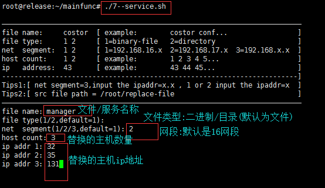
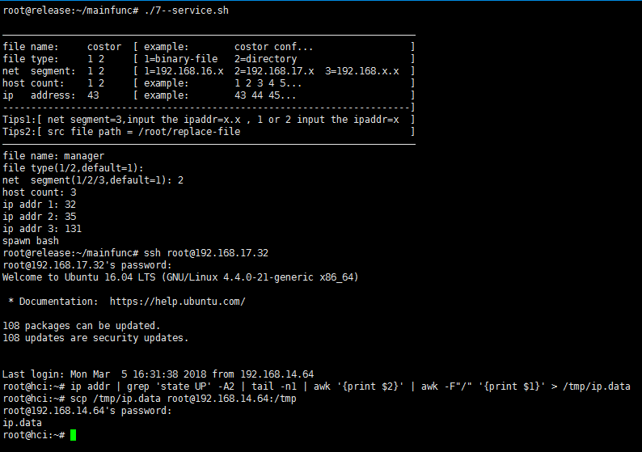
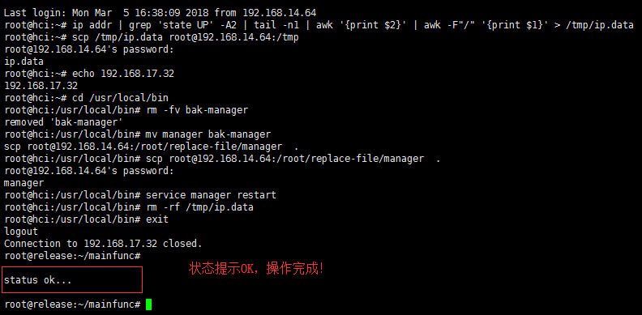
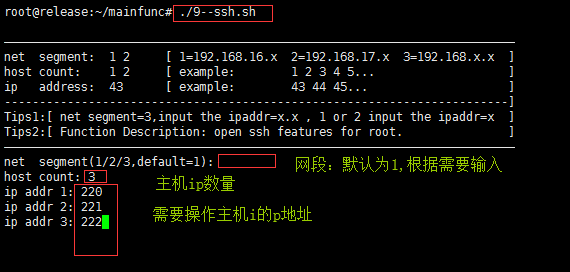
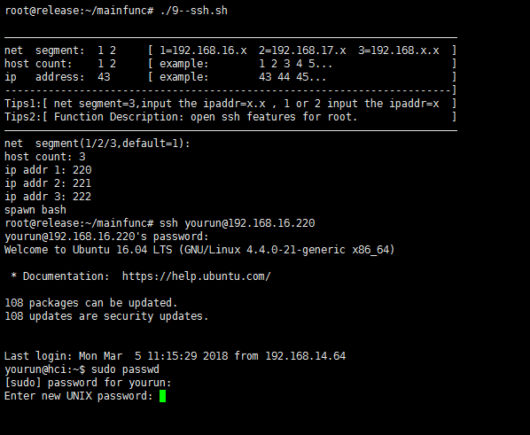
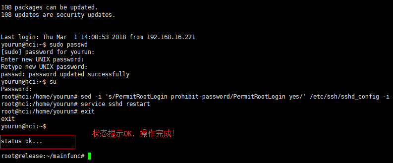
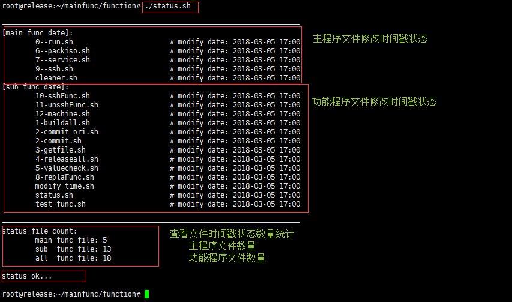
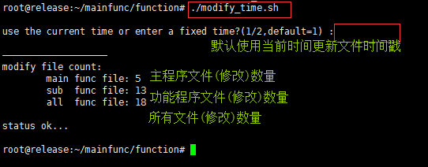
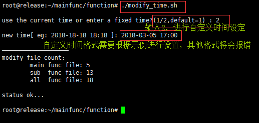

#  脚本说明文档(2018-03.23)

## 一、脚本文件分类

###  1. 主程序文件

| Name                               |        description         | directory   |
| ---------------------------------- | :------------------------: | :---------- |
| [0--run.sh](./0--run.sh)           |          编译/拷贝文件           | ./          |
| [6--packiso.sh](./6--packiso.sh)   |           完成镜像打包           | ./          |
| [7--service.sh](./7--service.sh)   |       文件替换及其服务重启主程序        | ./          |
| [9--ssh.sh](./9--ssh.sh)           | ssh root连接权限开启与root密码修改主程序 | ./          |
| [13--sbnfs.sh](./13--sbnfs.sh)     |      开启samba和nfs服务主程序      | ./          |
| [15--nethost.sh](./15--nethost.sh) |   查询网络主机的物理机IP与VNC端口主程序    | ./          |
| [cleaner.sh](./cleaner.sh)         |        清除所有产生的临时文件         | ./          |
| [*编译部署文档.md](./function/)          |          编译部署指导文档          | ./function/ |
| [*脚本说明文档.md](./function/)          |          脚本说明使用文档          | ./function/ |

###  2. 功能程序文件

| Name                                     |             description              | directory   |
| :--------------------------------------- | :----------------------------------: | :---------- |
| [1-buildall.sh](./function/1-buildall.sh) |               二进制文件编译                | ./function/ |
| [2-commit_ori.sh](./function/2-commit_ori.sh) |          获取git commit log值           | ./function/ |
| [2-commit.sh](./function/2-commit.sh)    |          获取git commit log值           | ./function/ |
| [3-getfile.sh](./function/3-getfile.sh)  |       从远端获取costor,libtarget等文件       | ./function/ |
| [4-releaseall.sh](./function/4-releaseall.sh) |        拷贝develop文件到release目录         | ./function/ |
| [5-valuecheck.sh](./function/5-valuecheck.sh) |              文件检测并输出到屏幕              | ./function/ |
| [8-replaFunc.sh](./function/8-replaFunc.sh) |            文件替换及其服务重启功能程序            | ./function/ |
| [10-sshFunc.sh](./function/10-sshFunc.sh) |     ssh root连接权限开启与root密码修改功能程序      | ./function/ |
| [11-unsshFunc.sh](./function/11-unsshFunc.sh) |          ssh root连接权限关闭功能程序          | ./function/ |
| [12-machine.sh](./function/12-machine.sh) | 删除/替换machine.conf文件及system-id.conf文件 | ./function/ |
| [14-sbnfsFunc.sh](./function/14-sbnfsFunc.sh) |          开启samba和nfs服务功能程序           | ./function/ |
| [16-nhostFunc.sh](./function/16-nhostFunc.sh) |        查询网络主机的物理机IP与VNC端口功能程序        | ./function/ |
| [file_monitor.sh](./function/file_monitor.sh) |        监测脚本文件修改状态,自动更新文件修改时间戳        | ./function/ |
| [modify_time.sh](./function/modify_time.sh) |           统一修改所有文件的编辑/修改日期           | ./function/ |
| [setattr.sh](./function/setattr.sh)      |       设置所有文件的attr额外属性(chattr)        | ./function/ |
| [status.sh](./function/status.sh)        |         显示所有主程序及功能程序文件的修改日期          | ./function/ |
| [test_func.sh](./function/test_func.sh)  |                测试功能程序                | ./function/ |

###  3. 脚本数量统计

> 主程序文件：`7` 
> 功能程序文件：`17` 
> 说明文档：`2` 

## 二、脚本应用实例

### 1. `文件替换` 脚本程序应用示例

> [脚本名称]：`7--service.sh` 

> [文件名称]：服务名称 (文件名称)
> [文件类型]：1/2 (二进制/文件夹,默认是二进制)
> [网络分段]：1/2/3 (默认是1,16网段)
> 			网段1：192.168.16.x
> 			网段2：192.168.17.x
> 			网段3：192.168.x.x  
> [主机数量]：ip地址数量 (需要操作的主机ip的数量)
> [   ip 地址]：根据网段进行ip地址输入
> 			网段为1/2：输入x(如33,表示192.168.16.3/192.168.17.33)
> 			网段为    3：输入 x.x(如14.64,表示192.168.14.64)
> [补充说明1]：程序最后给出 `status ok...` 表示程序执行完成
> [补充说明2]：程序执行完成不代表执行成功(因网络状况而定),需要我们关注执行过程是否发生错误

* `service` 程序主界面

 

* `service` 程序执行过程

 

* `service` 程序执行结束

 

### 2. `SSH_ROOT权限开启` 脚本程序应用示例

> [脚本名称]：`9--ssh.sh` 

> [网络分段]：1/2/3 (默认是1,16网段)
> 			网段1：192.168.16.x
> 			网段2：192.168.17.x
> 			网段3：192.168.x.x 
> [主机数量]：ip地址数量 (需要操作的主机ip的数量)
> [   ip 地址]：根据网段进行ip地址输入
> 			网段为1/2：输入x(如33,表示192.168.16.3/192.168.17.33)
> 			网段为    3：输入 x.x(如14.64,表示192.168.14.64)
> [补充说明1]：程序最后给出 `status ok...` 表示程序执行完成
> [补充说明2]：程序执行完成不代表执行成功(因网络状况而定),需要我们关注执行过程是否发生错误
> [补充说明3]：根据需要进行功能切换
> 			EXEC_FILE="function/10-sshFunc.sh      :开启root账户的ssh连接权限
> 			EXEC_FILE="function/11-unsshFunc.sh  :关闭root账户的ssh连接权限

* `ssh` 程序主界面

  

* `ssh` 程序执行过程

  

* `ssh` 程序执行结束

  

### 3. `文件状态查看` 脚本程序应用示例

> [脚本名称]：`function/status.sh` 

> 整个界面分为：
> 			主程序时间戳状态
> 			功能程序时间戳状态
> 			时间戳状态文件数量合计

* `status` 程序执行界面

  

### 4. `统一文件修改时间戳` 脚本程序应用示例

> [脚本名称]：`function/modify_time.sh` 

> 时间戳状态：1/2(当前时间还是自定义时间,默认当前时间)
> 			当前时间：    date "+%Y-%m-%d %H:%M"
> 			自定义时间：1970-01-01 00:00 (规范格式,其他格式输入会出错)

* `modify_time` 程序使用  `当前时间选项作为时间戳更新选项` 

  

* `modify_time` 程序使用  `自定义设置时间作为时间戳更新选项`  

  

