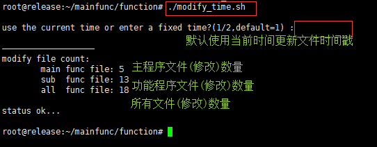
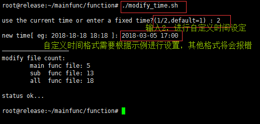

# 脚本说明文档(2018-04.10)

## 一、脚本文件分类

###  1. 主程序文件

| Name                               |        Description         | Dependent File |
| ---------------------------------- | :------------------------: | :------------- |
| [0--run.sh](./0--run.sh)           |          编译/拷贝文件           | 1-buildall.sh  |
| [6--packiso.sh](./6--packiso.sh)   |           完成镜像打包           | 1-buildall.sh  |
| [7--service.sh](./7--service.sh)   |       文件替换及其服务重启主程序        | 1-buildall.sh  |
| [9--ssh.sh](./9--ssh.sh)           | ssh root连接权限开启与root密码修改主程序 | 1-buildall.sh  |
| [13--sbnfs.sh](./13--sbnfs.sh)     |      开启samba和nfs服务主程序      | 1-buildall.sh  |
| [15--nethost.sh](./15--nethost.sh) |   查询网络主机的物理机IP与VNC端口主程序    | 1-buildall.sh  |
| [cleaner.sh](./cleaner.sh)         |        清除所有产生的临时文件         | 1-buildall.sh  |
| [*编译部署文档.md](./function/)          |          编译部署说明文档          | 1-buildall.sh  |
| [*脚本说明文档.md](./function/)          |          脚本说明使用文档          | 1-buildall.sh  |

###  2. 功能程序文件

| Name                                     |             Description              | Dependent File |
| :--------------------------------------- | :----------------------------------: | :------------- |
| [1-buildall.sh](./function/1-buildall.sh) |               二进制文件编译                | 无              |
| [2-commit_ori.sh](./function/2-commit_ori.sh) |          获取git commit log值           | 1-buildall.sh  |
| [2-commit.sh](./function/2-commit.sh)    |          获取git commit log值           | 1-buildall.sh  |
| [3-getfile.sh](./function/3-getfile.sh)  |       从远端获取costor,libtarget等文件       | 1-buildall.sh  |
| [4-releaseall.sh](./function/4-releaseall.sh) |        拷贝develop文件到release目录         | 1-buildall.sh  |
| [5-valuecheck.sh](./function/5-valuecheck.sh) |              文件检测并输出到屏幕              | 1-buildall.sh  |
| [8-replaFunc.sh](./function/8-replaFunc.sh) |            文件替换及其服务重启功能程序            | 1-buildall.sh  |
| [10-sshFunc.sh](./function/10-sshFunc.sh) |     ssh root连接权限开启与root密码修改功能程序      | 1-buildall.sh  |
| [11-unsshFunc.sh](./function/11-unsshFunc.sh) |          ssh root连接权限关闭功能程序          | 1-buildall.sh  |
| [12-machine.sh](./function/12-machine.sh) | 删除/替换machine.conf文件及system-id.conf文件 | 无              |
| [14-sbnfsFunc.sh](./function/14-sbnfsFunc.sh) |          开启samba和nfs服务功能程序           | 1-buildall.sh  |
| [16-nhostFunc.sh](./function/16-nhostFunc.sh) |        查询网络主机的物理机IP与VNC端口功能程序        | 1-buildall.sh  |
| [file_monitor.sh](./function/file_monitor.sh) |        监测脚本文件修改状态,自动更新文件修改时间戳        | 1-buildall.sh  |
| [md5value.sh](./function/md5value.sh)    |           检测所有文件MD5值/创建软链接           | 无              |
| [modify_time.sh](./function/modify_time.sh) |           统一修改所有文件的编辑/修改日期           | 无              |
| [setattr.sh](./function/setattr.sh)      |       设置所有文件的attr额外属性(chattr)        | 无              |
| [status.sh](./function/status.sh)        |         显示所有主程序及功能程序文件的修改日期          | 无              |
| [test_func.sh](./function/test_func.sh)  |                测试功能程序                | 无              |

###  3. 依赖文件说明

| Name                 | Dependent File And Directory             |
| :------------------- | :--------------------------------------- |
| 3-getfile.sh         | 192.168.14.250:/home/vespace_release5.4/costor/costor          (拷贝到对应目录) |
|                      | 192.168.14.250:/home/vespace_release5.4/costor/libtarget.so (拷贝到对应目录) |
|                      | 192.168.14.250:/home/vespace_release5.4/costor/target*         (拷贝到对应目录) |
|                      |                                          |
| 4-releaseall.sh      | /root/replace-file/etcd*             (etcd文件位于/root/replace-file目录,不能删除) |
|                      | /root/replace-file/libtarget.so   (通过3-getfile.sh远程拷贝得到) |
|                      |                                          |
| 8-replaFunc.sh       | /root/replace-file/file-name      (/root/replace-file下的任意需要替换的文件) |
|                      |                                          |
| 12-machine.sh        | 192.168.16.227:/root/systemvm/machine.conf |
|                      |                                          |
| 14-sbnfsFunc.sh      | 192.168.14.64:/root/replace-file/sources.list    (apt源) |
|                      | 192.168.14.64:/root/replace-file/resolv.conf     (dns配置文件) |
|                      |                                          |
| /root/replace-file说明 | 1. 尽量不要删除该目录,该目录删除前需要备份下面列出的几个文件         |
|                      | 2. etcd/etcdctl 文件不能删除 (4-releaseall.sh脚本依赖) |
|                      | 3. sources.list/resolv.conf 文件不能删除 (14-sbnfsFunc.sh脚本依赖) |
|                      | 4. 该目录作为脚本依赖目录,执行相应的脚本需要拷贝相应的依赖文件到该目录之下  |
|                      | 5. 所有的脚本都可以放在自己的机器上运行 (特指服务脚本)           |

###  4. 脚本数量统计

> 主程序文件：`7` 
> 功能程序文件：`18` 
> 说明文档：`2` 

## 二、脚本应用实例

### 1. `文件替换` 脚本程序应用示例

> [脚本名称]：`7--service.sh` 

> [文件名称]：服务名称 (文件名称)
> [文件类型]：1/2 (二进制/文件夹,默认是二进制)
> [网络分段]：1/2/3 (默认是1,16网段)
> 			网段1：192.168.16.x
> 			网段2：192.168.17.x
> 			网段3：192.168.x.x  
> [主机数量]：ip地址数量 (需要操作的主机ip的数量)
> [   ip 地址]：根据网段进行ip地址输入
> 			网段为1/2：输入x(如33,表示192.168.16.3/192.168.17.33)
> 			网段为    3：输入 x.x(如14.64,表示192.168.14.64)
> [补充说明1]：程序最后给出 `status ok...` 表示程序执行完成
> [补充说明2]：程序执行完成不代表执行成功(因网络状况而定),需要我们关注执行过程是否发生错误

* `service` 程序主界面

 

* `service` 程序执行过程

 

* `service` 程序执行结束

 

### 2. `SSH_ROOT权限开启` 脚本程序应用示例

> [脚本名称]：`9--ssh.sh` 

> [网络分段]：1/2/3 (默认是1,16网段)
> 			网段1：192.168.16.x
> 			网段2：192.168.17.x
> 			网段3：192.168.x.x 
> [主机数量]：ip地址数量 (需要操作的主机ip的数量)
> [   ip 地址]：根据网段进行ip地址输入
> 			网段为1/2：输入x(如33,表示192.168.16.3/192.168.17.33)
> 			网段为    3：输入 x.x(如14.64,表示192.168.14.64)
> [补充说明1]：程序最后给出 `status ok...` 表示程序执行完成
> [补充说明2]：程序执行完成不代表执行成功(因网络状况而定),需要我们关注执行过程是否发生错误
> [补充说明3]：根据需要进行功能切换
> 			EXEC_FILE="function/10-sshFunc.sh      :开启root账户的ssh连接权限
> 			EXEC_FILE="function/11-unsshFunc.sh  :关闭root账户的ssh连接权限

* `ssh` 程序主界面

  

* `ssh` 程序执行过程

  

* `ssh` 程序执行结束

  

### 3. `文件状态查看` 脚本程序应用示例

> [脚本名称]：`function/status.sh` 

> 整个界面分为：
> 			主程序时间戳状态
> 			功能程序时间戳状态
> 			时间戳状态文件数量合计

* `status` 程序执行界面

  

### 4. `统一文件修改时间戳` 脚本程序应用示例

> [脚本名称]：`function/modify_time.sh` 

> 时间戳状态：1/2(当前时间还是自定义时间,默认当前时间)
> 			当前时间：    date "+%Y-%m-%d %H:%M"
> 			自定义时间：1970-01-01 00:00 (规范格式,其他格式输入会出错)

* `modify_time` 程序使用  `当前时间选项作为时间戳更新选项` 

  

* `modify_time` 程序使用  `自定义设置时间作为时间戳更新选项`  

  

